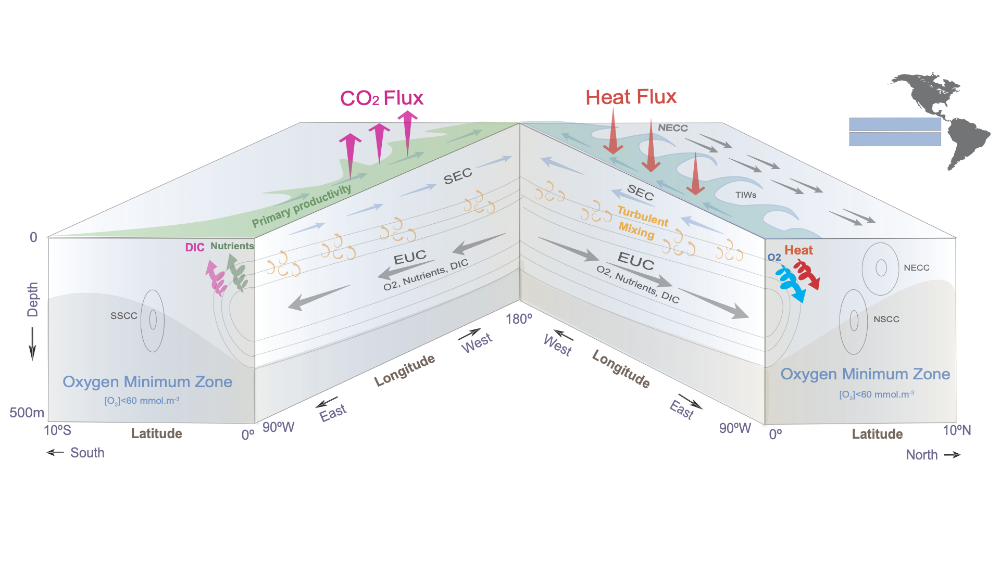

# Summary

We summarize our findings as follow:
1. Mesoscale eddies are important for the equatorial Oxygen balance. 
2. Vertical mixing is an important source of oxygen supply to the upper equatorial themrocline
3. The mesoscale eddy field interacts with the large scale circualtion to inudce intensified mixing over seasonal timescales to oxygenate the upper equatorial Pacific thermocline




```{tableofcontents}
```
